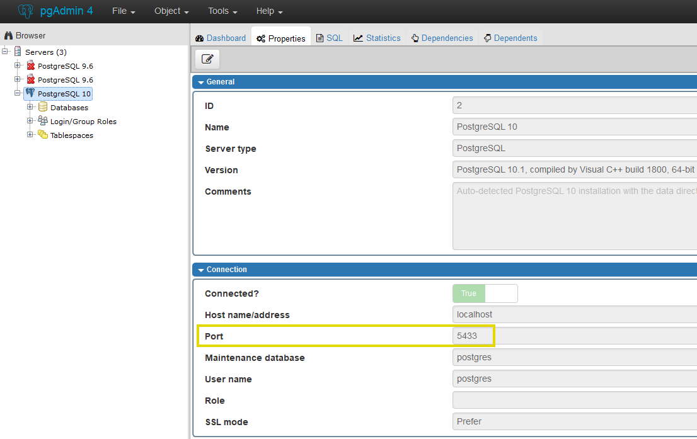

# PostgreSQL - Python connection

Τhe code is a framework through which the user can manipulate a relational PostgreSQL database in a pythonic way, like using Pandas DataFrames.  

# Instructions

In order to run the script properly, the user has to update the provided configuration file named "credentials.ini" (which has to be placed in the same directory with the script itself) with his own credentials used in the PostgreSQL localhost process, such as the database name, the username, the password and the port.  
  
The exact location of the port value in the pgAdmin 4 console is depicted in the below snapshot.  
  

